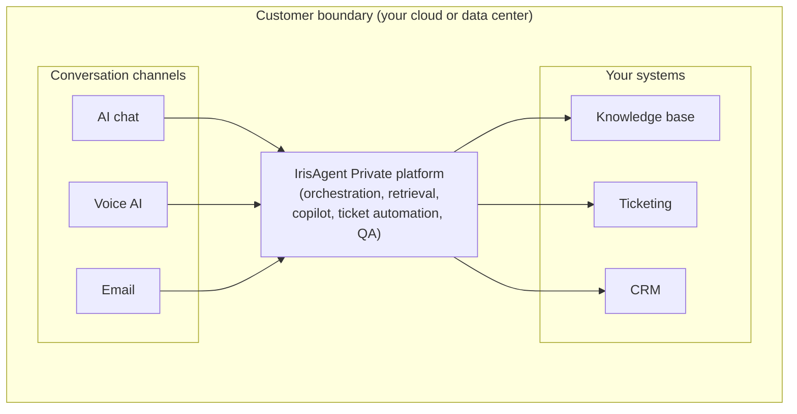

## Introduction

IrisAgent Private is the full IrisAgent platform for AI customer conversations (AI chat, voice AI, agent assist and copilot, ticket automation, and auto QA) deployed inside your own environment. It is software only. It installs on infrastructure you already run, whether that is your own data center or your own cloud account. There is no vendor hardware appliance to rack, ship, or maintain.

With IrisAgent Private, every customer conversation (chat, voice, and email), every retrieval against your knowledge base, every model inference call, and every audit log stays within your network boundary. Your data does not leave your environment.

<Note>
  IrisAgent Private serves all of your customer conversation channels: chat, voice, email, and agent copilot. It is the same conversation orchestration, retrieval, ticket automation, and QA you get from the cloud product, deployed where your data already lives.
</Note>

## Deployment modes

IrisAgent Private supports three deployment modes. All three keep customer conversation data inside your boundary.

| Mode | Where it runs | Network egress | Best for |
| --- | --- | --- | --- |
| Customer VPC (private cloud) | Your own AWS, Azure, or GCP account, inside your VPC or tenant | None to public model APIs or IrisAgent cloud; optional private links to your own systems | Teams already standardized on a cloud provider that want data sovereignty without managing physical servers |
| On-premise data center | Your own servers behind your firewall | Controlled outbound only, through your existing change-control and egress policies | Regulated organizations that require data to remain in a named facility |
| Air-gapped | Your own servers with no outbound internet at all | Zero outbound network calls | The most sensitive environments: defense, critical infrastructure, and isolated enclaves |

## Core principles

- **Zero data egress.** Customer conversations, retrieval, inference, and logging all happen inside your boundary. No conversation data is sent to IrisAgent cloud or to any external model API.
- **Data sovereignty.** Your data stays in the region, account, or facility you choose. You decide where it lives and who can reach it.
- **Examiner and audit readiness.** Every action is recorded in an audit trail you own and can hand to an examiner, auditor, or internal compliance team.
- **Private or bring-your-own models.** Run privately hosted model weights inside your environment, or point IrisAgent at a model endpoint you already operate within your tenant. No calls to public model APIs are required.
- **Role-based access and full audit trail.** Access is governed by your own identity provider with role-based access control (RBAC), and every interaction is logged for review.

## Compliance

IrisAgent is built and operated in alignment with SOC 2 Type II, HIPAA, GDPR, CCPA, and PCI DSS. IrisAgent Private extends these controls into your own environment, where you retain direct control over data residency, access, and retention.

## Platform inside your boundary

In every deployment mode, the IrisAgent Private platform sits inside your boundary. Your conversation channels connect to it on one side, and your knowledge, ticketing, and CRM systems connect to it on the other. Everything stays within the boundary.

## Next steps

- Read the [Reference Architecture: Customer Cloud (VPC)](/security-and-compliance/Reference-Architecture-Customer-VPC) to see how IrisAgent Private deploys into your own cloud account.
- Read the [Reference Architecture: On-Premise and Air-Gapped](/security-and-compliance/Reference-Architecture-On-Prem-Air-Gapped) to see how it deploys into your own data center, including the fully air-gapped variant.

Please [email us](mailto:contact@irisagent.com) to scope an IrisAgent Private deployment for your environment.
