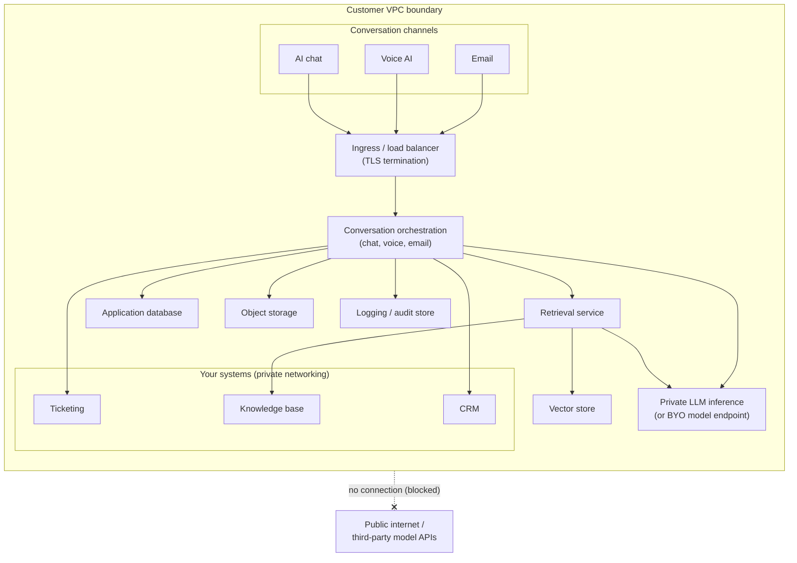

## Overview

This reference architecture deploys IrisAgent Private into your own cloud account (AWS, Azure, or GCP) inside your VPC or tenant. Every component that touches customer conversation data runs inside that boundary: conversation orchestration for chat, voice, and email, retrieval, the agent copilot, ticket automation, QA, and a privately hosted model inference service. No customer conversation data leaves your VPC, and there are no calls to public model APIs.

<Note>
  In this architecture, no customer conversation data leaves your VPC, and there are no external model API calls. Inference, embeddings, retrieval, and logging all run inside the boundary. Connections to your ticketing, CRM, and knowledge systems stay inside your network or travel over private networking (private link, peering, or service endpoints), never across the public internet.
</Note>

## Components

All of the following run inside your VPC or tenant:

- **Ingress and load balancer.** Terminates TLS and routes traffic from your conversation channels to the application services.
- **IrisAgent application services.** Conversation orchestration for chat, voice, and email, retrieval, the agent copilot, ticket automation, and QA.
- **Model inference service.** A privately hosted LLM running inside your tenant, or a bring-your-own model endpoint you already operate within the tenant. No public model API is called.
- **Vector store.** Stores embeddings for retrieval over your knowledge base.
- **Application database.** Stores configuration, conversation state, and metadata.
- **Object storage.** Stores documents, attachments, and model artifacts.
- **Logging and audit store.** Captures the full audit trail inside your account.

Connections to your ticketing, CRM, and knowledge base systems stay inside your network or travel over private networking.

## Deployment flow

<Steps>
  <Step title="Provision in your tenant">
    Provision the IrisAgent Private stack in your own cloud account, inside the VPC, region, and account you choose. Nothing runs in IrisAgent cloud.
  </Step>
  <Step title="Connect data sources over private networking">
    Connect your ticketing, CRM, and knowledge base systems using private link, VPC peering, or service endpoints so traffic never crosses the public internet.
  </Step>
  <Step title="Deploy via your IAM">
    Deploy and operate the stack using your own identity and access management. Roles, permissions, and encryption keys remain under your control.
  </Step>
  <Step title="Tune">
    Configure conversation behavior, retrieval, response style, and QA rules for your customer conversations. Validate against your own knowledge and ticket data.
  </Step>
  <Step title="Go live in days">
    Route your chat, voice, and email channels to the deployment and go live, typically in days rather than months.
  </Step>
</Steps>

## Keys and encryption

- **Customer-managed encryption keys (KMS).** You hold and rotate the keys used to encrypt data. IrisAgent never has access to them.
- **TLS in transit.** All traffic between channels, services, and datastores is encrypted in transit.
- **Encryption at rest.** The application database, vector store, object storage, and audit store are encrypted at rest with your keys.

## Data flow: zero egress

The diagram below shows the full data flow inside your VPC. Every component (channels, orchestration, retrieval, inference, vector store, datastores, and audit log) is inside the boundary. Inference, embeddings, retrieval, and logging all happen inside the VPC. The public internet and any third-party model APIs sit outside the boundary with no edge crossing into them.

## Next steps

- For your own data center or an air-gapped enclave, see the [Reference Architecture: On-Premise and Air-Gapped](/security-and-compliance/Reference-Architecture-On-Prem-Air-Gapped).
- For the bigger picture and deployment-mode comparison, see the [IrisAgent Private: Deployment Overview](/security-and-compliance/Private-Deployment-Overview).

Please [email us](mailto:contact@irisagent.com) to scope a customer-cloud deployment.
