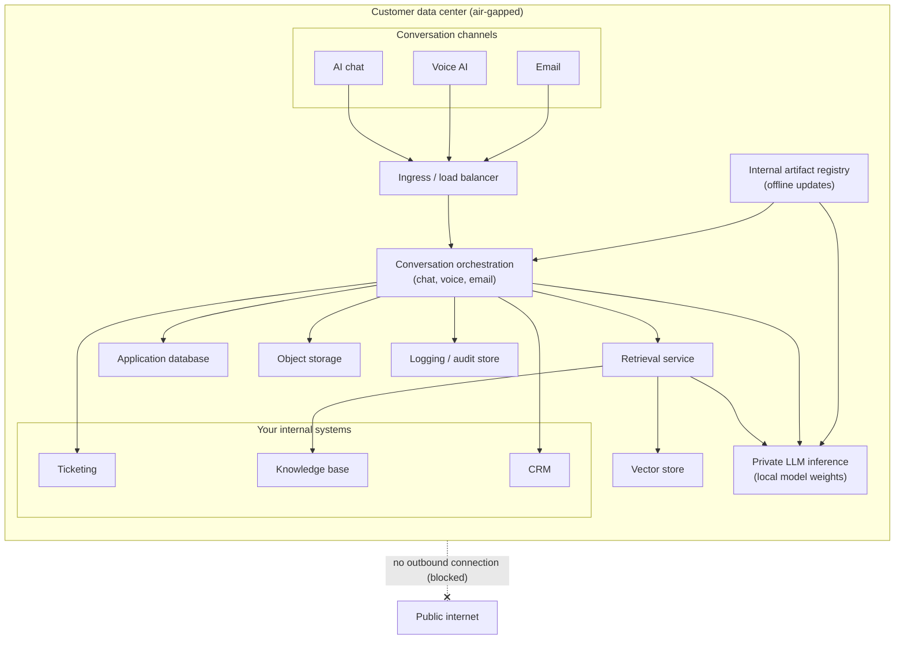

## Overview

This reference architecture deploys IrisAgent Private into your own data center, on servers behind your own firewall. It includes a fully air-gapped variant with no outbound internet at all. The component set matches the [customer-cloud architecture](/security-and-compliance/Reference-Architecture-Customer-VPC): conversation orchestration for chat, voice, and email, retrieval, the agent copilot, ticket automation, QA, a private model inference service, a vector store, datastores, and an audit log. The difference is that everything runs on your own servers behind your firewall rather than in a cloud account.

Private model weights are shipped and installed directly into the environment. Updates are delivered through your existing change-control process, for example an internal artifact registry, rather than through live internet calls.

<Note>
  In air-gapped mode there are zero outbound network calls. All inference and logging are local to your data center. Updates arrive through controlled offline or internal channels (for example a vetted artifact registry inside your network), never through live calls to the public internet.
</Note>

## Components

All of the following run on your own servers, behind your firewall:

- **Ingress and load balancer.** Routes traffic from your conversation channels to the application services, with TLS terminated inside your network.
- **IrisAgent application services.** Conversation orchestration for chat, voice, and email, retrieval, the agent copilot, ticket automation, and QA.
- **Model inference service.** Runs private model weights installed in the environment. No external model API is contacted.
- **Vector store.** Stores embeddings for retrieval over your knowledge base.
- **Application database, object storage, and audit store.** Hold configuration, conversation state, artifacts, and the full audit trail locally.

Connections to your internal ticketing, CRM, and knowledge base systems stay entirely within your network.

## Install flow

<Steps>
  <Step title="Install on existing servers">
    Install the IrisAgent Private stack on servers you already run inside your data center, behind your firewall.
  </Step>
  <Step title="Load private models">
    Load the private model weights shipped with the deployment directly into the environment. No internet download is required.
  </Step>
  <Step title="Connect internal ticketing, KB, and CRM">
    Connect your internal ticketing, knowledge base, and CRM systems over your internal network only.
  </Step>
  <Step title="Configure SSO and RBAC">
    Wire the deployment to your identity provider for single sign-on and role-based access control. See [Single Sign On (SSO) Options](/security-and-compliance/Single-Sign-On-Options).
  </Step>
  <Step title="Validate">
    Validate conversation behavior, retrieval, and QA against your own knowledge and ticket data inside the environment.
  </Step>
  <Step title="Go live">
    Route your chat, voice, and email channels to the deployment and go live, with no dependency on outbound internet.
  </Step>
</Steps>

## Updates under your change control

Because the air-gapped environment has no outbound internet, updates do not arrive through live calls. Instead, model and software updates are packaged and delivered through your existing change-control process, for example an internal artifact registry or an approved offline transfer. Your team reviews and promotes each update on your own schedule.

## Keys and encryption

- **Customer-managed encryption keys.** Keys are held and rotated within your environment. IrisAgent has no access to them.
- **TLS in transit.** Traffic between channels, services, and datastores is encrypted in transit inside your network.
- **Encryption at rest.** All datastores are encrypted at rest with your keys.

## Data flow: zero egress

The diagram below shows the air-gapped data flow. Every component (channels, orchestration, retrieval, inference, vector store, datastores, and audit log) is inside the data center boundary. The public internet sits outside the boundary, with no edge crossing into it. Inference and logging are entirely local.

## Next steps

- To deploy into your own cloud account instead of a data center, see the [Reference Architecture: Customer Cloud (VPC)](/security-and-compliance/Reference-Architecture-Customer-VPC).
- For the bigger picture and deployment-mode comparison, see the [IrisAgent Private: Deployment Overview](/security-and-compliance/Private-Deployment-Overview).

Please [email us](mailto:contact@irisagent.com) to scope an on-premise or air-gapped deployment.
